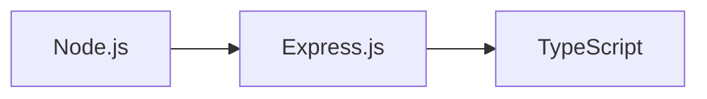
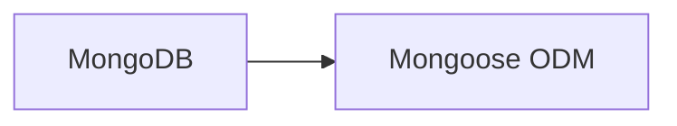
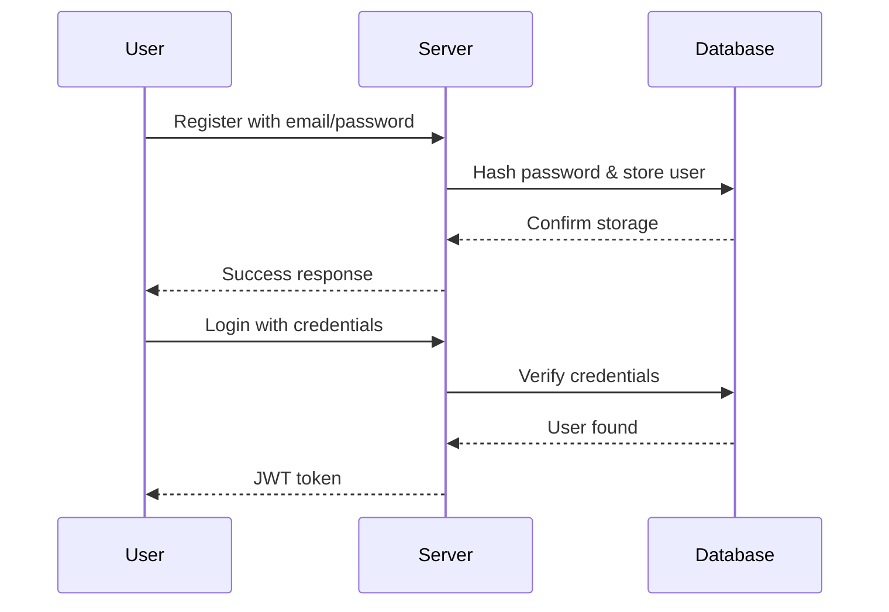

# 🚀 Subscription Tracker

## 📋 Table of Contents

1. [Project Overview](#project-overview)
2. [Features](#features)
3. [Tech Stack](#tech-stack)
4. [Prerequisites](#prerequisites)
5. [Installation Guide](#installation-guide)
6. [Environment Setup](#environment-setup)
7. [Running the Application](#running-the-application)
8. [API Documentation](#api-documentation)
9. [Authentication Flow](#authentication-flow)
10. [Project Structure](#project-structure)
11. [Contributing](#contributing)
12. [Troubleshooting](#troubleshooting)

## 📌 Project Overview

Subscription Tracker is a modern web application designed to help users efficiently manage and monitor their subscriptions. Built with TypeScript and Express.js, it provides a secure and scalable solution for subscription management with features like user authentication and CRUD operations.

## ✨ Features

| Feature | Description |
|---------|-------------|
| 🔐 Authentication | Complete user authentication system (Sign Up, Sign In, Sign Out) |
| 📝 CRUD Operations | Full subscription management capabilities |
| 🔒 Security | JWT-based authentication with secure password hashing |
| 📊 Database | Robust MongoDB integration with Mongoose ODM |
| 🛠 TypeScript | Full TypeScript support for better development experience |

## 🛠 Tech Stack

### Backend Framework


### Database & ORM


### Security & Authentication
- 🔑 JSON Web Tokens (JWT)
- 🔒 Bcrypt Password Hashing
- 🛡 Cookie-based Authentication

## 📦 Prerequisites

Before starting, ensure you have the following installed:

| Requirement | Version | Description |
|-------------|---------|-------------|
| Node.js | v18+ | JavaScript runtime |
| Bun | Latest | Modern JavaScript runtime & package manager |
| MongoDB | Latest | Database server |

## 🚀 Installation Guide

1. **Clone the Repository**
   ```bash
   git clone https://github.com/your-username/tracker-suscription.git
   cd tracker-suscription
   ```

2. **Install Dependencies**
   ```bash
   bun install
   ```

## ⚙️ Environment Setup

1. Create a `.env.development.local` file in the project root:

   ```env
   # Server Configuration
   PORT=5500
   NODE_ENV=development

   # Database Configuration
   DB_URI=mongodb://your-mongodb-connection-string

   # JWT Authentication
   JWT_SECRET="your-secret-key"
   JWT_EXPIRES_IN=1d
   ```

2. **Environment Variables Description**

   | Variable | Description | Example |
   |----------|-------------|----------|
   | PORT | Server port number | 5500 |
   | NODE_ENV | Environment mode | development |
   | DB_URI | MongoDB connection string | mongodb://localhost:27017/subscription-tracker |
   | JWT_SECRET | Secret key for JWT | your-secret-key |
   | JWT_EXPIRES_IN | JWT expiration time | 1d |

## 🎯 Running the Application

### Development Mode
```bash
bun dev
```

### Production Build
```bash
bun run build
bun start
```

## 📡 API Documentation

### Authentication Endpoints

| Method | Endpoint | Description | Authentication Required |
|--------|----------|-------------|----------------------|
| POST | `/api/v1/auth/sign-up` | Register new user | No |
| POST | `/api/v1/auth/sign-in` | User login | No |
| GET | `/api/v1/auth/sign-out` | User logout | Yes |

### Subscription Endpoints

| Method | Endpoint | Description | Authentication Required |
|--------|----------|-------------|----------------------|
| GET | `/api/v1/subscriptions` | Get all subscriptions | Yes |
| GET | `/api/v1/subscriptions/:id` | Get specific subscription | Yes |
| POST | `/api/v1/subscriptions` | Create subscription | Yes |
| PUT | `/api/v1/subscriptions/:id` | Update subscription | Yes |
| DELETE | `/api/v1/subscriptions/:id` | Delete subscription | Yes |

## 🔒 Authentication Flow



## 📁 Project Structure

```
project-root/
├── config/
│   ├── arcjet.ts
│   └── env.ts
├── controllers/
│   ├── auth.controller.ts
│   └── user.controller.ts
├── database/
│   └── mongodb.ts
├── middleware/
│   ├── arcjet.middleware.ts
│   ├── auth.middleware.ts
│   └── error.middleware.ts
├── models/
│   ├── subscription.model.ts
│   └── user.model.ts
└── routes/
    ├── auth.routes.ts
    ├── subscription.routes.ts
    └── user.routes.ts
```

## 🤝 Contributing

1. Fork the repository
2. Create your feature branch: `git checkout -b feature/amazing-feature`
3. Commit your changes: `git commit -m 'Add amazing feature'`
4. Push to the branch: `git push origin feature/amazing-feature`
5. Open a Pull Request

## 🔧 Troubleshooting

| Issue | Solution |
|-------|----------|
| MongoDB Connection Failed | Check if MongoDB is running and connection string is correct |
| JWT Token Invalid | Ensure JWT_SECRET is properly set in .env file |
| Port Already in Use | Change PORT in .env file or kill the process using the port |

## 📞 Support

For support, please open an issue in the GitHub repository or contact the maintainers.

---

📝 **License**: MIT
